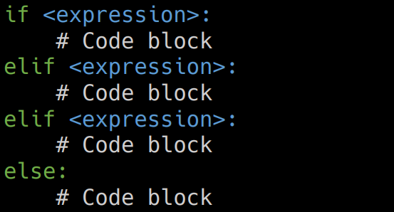
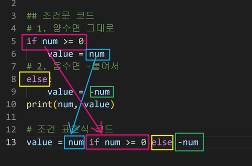
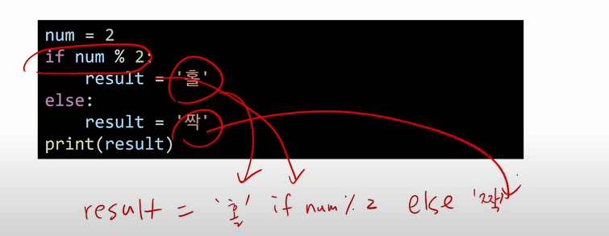
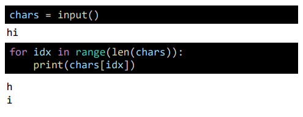
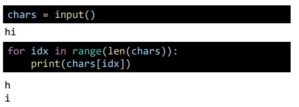
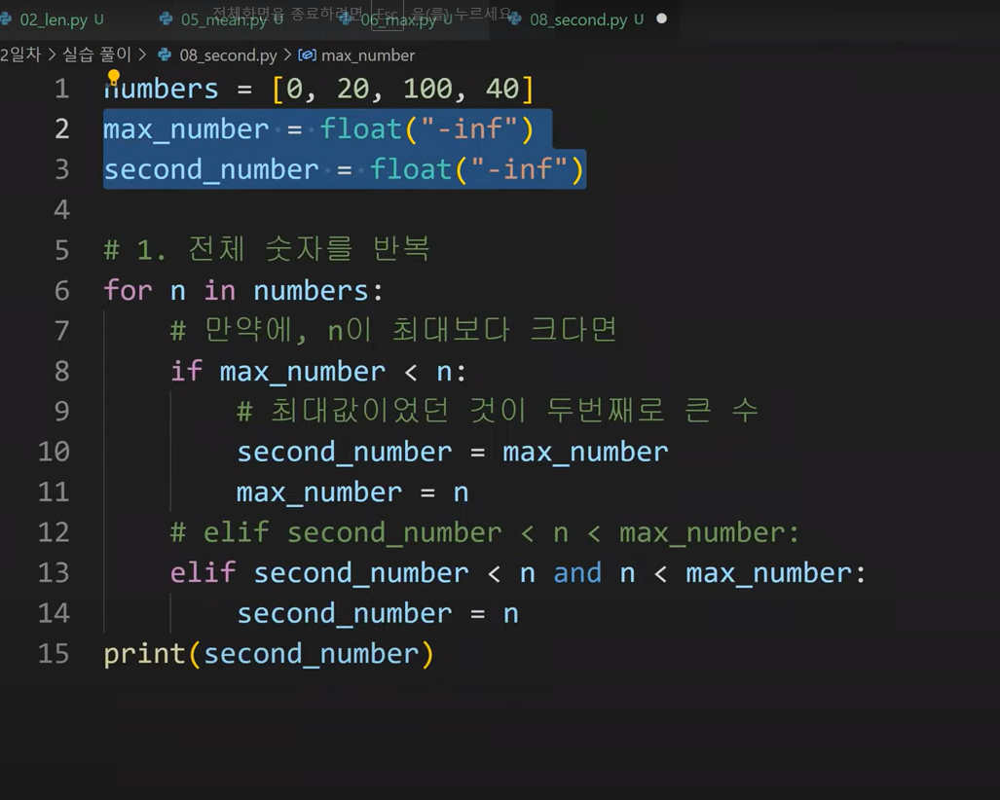

# 제어문

> 제어문이란?
>
> - 파이썬은 기본적으로 위에서부터 아래로 순차적으로 명령을 수행
> - 특정 상황에 따라 코드를 선택적으로 실행(분기/조건)하거나 계속하여 실행(반복)하는 제어가 필요함
> - 제어문은 순서도로 표현이 가능


## 조건문

- expression에 참/ 거짓에 대한 조건식

  - 조건이 참인 경우 들여쓰기 되어있는 코드 블럭을 실행

  - 이외의 경우 else 이후 들여쓰기 되어있는 코드 블럭을 실행

    - else는 선택적으로 활용가능

      ```python
      a = 10
      if a >= 0:
          print('양수')
      else:
          print('음수')
      print(a)
      ```

      

### 복수 조건문

복수의 조건식을 활영할 경우 elif를 활용하여 표현




### 중첩 조건문

- 조건문은 다른 조건문에 중첩되어 사용될 수 있음
  - 들여쓰기를 유의하여 작성할 것

​	


## 조건 표현식 코드

- 조건표현식(Conditional Expression)이란?
  - 조건 표현식을 일반적으로 조건에 따라 값을 할당 할 때 활용






절대값을 저장하기 위한 코드


## 반복문

- while 문
  - 종료조건에 해당하는 코드를 통해 반복문을 종료시켜야함
- for문
  - 반복 가능한 객체를 모두 순화하면 종료
- 반복제어
  - break, continue, for-else


### While문

- while문은 조건식이 참인 경우 반복적으로 코드를 실행
  - 조건이 참인 경우 들여쓰기 되어 있는 코드 블록이 실행됨
  - 코드 블록이 모두 실행되고 다시 조건식을 검사하며 반복적으로 실행됨
  - while문은 무한 루프를 하지 않도록 종료조건이 반드시 필요


### For문

- for문은 시퀀스(string, tuple, list, range)를 포함한 순회가능한 객체 요소를 모두 순회함
  - 처음부터 끝까지 모두 순회하므로 별도의 종료조건이 필요 X


- For문 일반 형식
  - 순회할 수 있는 자료형(str, list, dict 등)
  - 순회형 함수 (range, enumerate)


- 문자열 순회



사용자가 입력한 문자를 range를 활용하여 한 글자씩 출력하시오




#### 딕셔너리 순회

- 딕셔너리는 기본적으로 key를 순회하며 key를 통해 값을 활용

  ```python
  grades = {'john' : 80, 'eric': 90}
  for name in grades:
      print(name)
      
  # john
  # eric
  ```

  ```python
  grades = {'john' : 80, 'eric': 90}
  for name in grades:
      print(name, grades[name])
      
  # john 80
  # eric 90
  ```


## 반복문 제어

- break : 반복문을 종료
- continue : continue 이후의 코드 블록은 수행하지 않고 다음 반복을 수행
- for-else : 끝까지 반복문을 실행한 이후에 else문 실행
  - break를 통해 중간에 종료되는 경우 else문은 실행되지 않음


### break

- break문을 만나면 반복문은 종료됨


### Continue

- continue 이후의 코드 블록은 수행하지 않고 다음 반복을 수행

  ```python
  for i in range(6):
      if i % 2 == 0:
          continue
      print(i)
      
  # 1
  # 3
  # 5
  ```


### for-else

```python
for char in 'apple':
    if char == 'b':
        print('b!')
        break
else:
    print('b가 없습니다') 

# b가 없습니다


for char in 'apple':
    if char == 'a':
        print('a!')
        break
else:
    print('a가 없습니다') 

# a!
```


## 문제풀이

2번째로 큰 수를 구하시오


