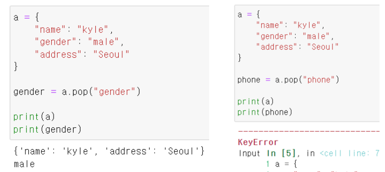
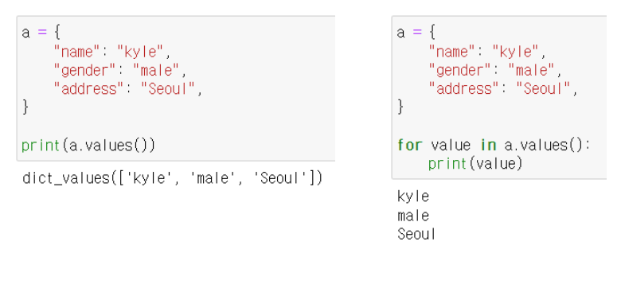
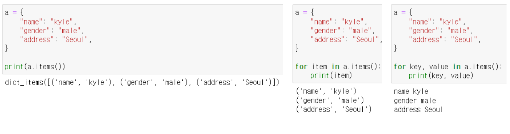

# [Algorithm] 딕셔너리

## 해시 테이블

딕셔너리(dict)의 정식 이름, 파이썬에는 딕셔너리 자료구조가 내장 되어 있다

- 순서가 없음

- `Key` 는 `immutable (변경 불가능)`

- `해시 함수` : 임의 길이의 데이터를 고정 길이의 데이터로 매핑하는 함수
  
  - `매핑` 이란 `하나의 값을 다른 값으로 대응` 시키는 것

- `해시` : 해시 함수를 통해 얻어진 값

- 해시 함수와 해시 테이블을 이용하기 때문에 **삽입, 삭제, 수정, 조회 연산의 속도가 리스트보다 빠르다**
  
  - 산술 계산으로 값이 있는 위치를 바로 알 수 있기 때문

### 리스트와 딕셔너리 비교

| 연산 종류       | 딕셔너리(Dictionary) | 리스트(List)    |
| ----------- | ---------------- | ------------ |
| Get Item    | O(1)             | O(1)         |
| Insert Item | O(1)             | O(1) 또는 O(N) |
| Update Item | O(1)             | O(1)         |
| Delete Item | O(1)             | O(1) 또는 O(N) |
| Search Item | O(1)             | O(N)         |

### 딕셔너리는 언제 사용할까?

- 리스트를 사용하기 힘든 경우
- 데이터에 대한 `빠른 접근 탐색` 이 필요한 경우
  - 현실 세계의 대부분의 데이터를 다룰 경우

---

## 기본 문법

### 선언

변수 = {key1: value1, key2: value2}

```python
# 'Key' : Value 구성의 딕셔너리
a = {
'name': 'kyle',  'gender': 'male',  'address': 'Seoul'
}
print(a)
```

### 삽입/수정

| 딕셔너리[key] = value |
|:-----------------:|

내부에 해당 key가 없으면 삽입, 있으면 수정


### 삭제 및 반환

| 딕셔너리.pop(key, default) |
| ---------------------- |

key: (필수) dic에서 제거하거나 검색할 키입니다.

default: (선택 사항) 사전에서 키를 찾을 수 없는 경우 반환될 값




### 조회

| 딕셔너리[key]                 | 딕셔너리.get(key, default) |
| ------------------------- |:----------------------:|
| 해당하는 키의 값이 없을 경우 keyError | 해당 하는 키 없을 경우 None 반환  |

age = a['age']
age = a.get('age', 30)

### Counter 내장함수 활용

```python
from collections import Counter

socres = ['A', 'A', 'B', 'C', 'D', 'A', 'B']
easy_counter = Counter(scores)
print(easy_counter)
```

---

## 메소드

## .keys()

딕셔너리의 **key 목록**이 담긴 dict_keys 객체 반환


### .values()

딕셔너리의 value 목록이 담긴 dict_values 객체 반환



### .items()

딕셔너리의 (key, value) 쌍 목록이 담긴 dict_items 객체 반환(튜플)



**정리**

| 메소드      | 설명                                      |
| -------- | --------------------------------------- |
| .keys()  | **Key** 목록이 담긴 dict_keys 객체 반환          |
| .valus() | **Value** 목록이 담긴 dict_values 객체 반환      |
| .items() | **Key, Value** 목록이 담긴 dict_values 객체 반환 |

```python
john = {  'name': 'john',  'role': 'ceo'
}
# 1. name role => key
# 2. john ceo => value
# 3. name john role ceo => key & value

print(john.keys())
print(john.values())
print(john.items())


# 키를 전부 뽑아낼 때💡
for key in john.keys():  print(key)


# 키, 밸류 전부 뽑아낼 때💡
for k, v in john.items():  print(k, v)
```

```python
data = {}

# 1.
number = int(input())

# 2.
for _ in range(number):    user_input = input()    # name capital
    # ex) korea seoul

    user_input_list = user_input.split()    # => ['korea', 'seoul']

    data[user_input_list[0]] = user_input_list[1]    # data['korea'] ='seoul'

user_answer = input()
# korea

print(data[user_answer])
# data['korea'] => 'seoul'
```

```python
user_input = ['Jay', 'John', 'John', 'Jay', 'Jack', 'Jack', 'John', 'Jo', 'Jo']

from collections import Counter

print(Counter(user_input))

# 흑마법...
print(Counter(user_input).most_common())
```
