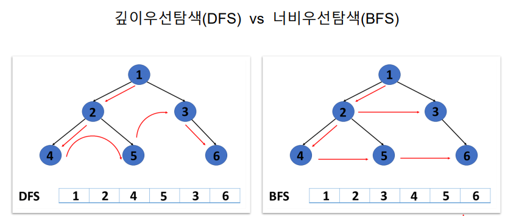

# 깊이우선탐색 (DFS)

## 1. 그래프 탐색 알고리즘

> 시작 정점에서 간선을 타고 이도알 수 있는 모든 정점을 찾는 알고리즘

| 스택 + 그래프 |
| -------- |

- **깊이우선탐색 (Depth-First Search / DFS)**

그래프의 깊이를 우선으로 탐색하기 위해 스택의 개념을 활용한다

| 그래프 + 큐 |
| ------- |

- **너비우선탐색 (Breadth-First Search / BFS)**

그래프의 너비를 우선으로 탐색하기 윟 큐의 개념을 활용한다



## 2. 깊이우선탐색 (DFS)

> 시작 정점으로부터 갈 수 있는 하위 정점까지 가장 깊게 탐색
> 
>  더 이상 갈 곳이 없다면 마지막 갈림길로 돌아와서 
> 
> 다른 정점을 탐색하여 모든 정점을 방문하는 순회방법

<mark>모든 정점을 방문할 때</mark> 유리하다. 

<mark>경우의 수, 순열과 조합</mark> 문제에서 많이 사용한다

너비우선탐색에 비해 코드 구현이 간단하다

모든 정점을 방문할 필요가 없고, 최단 거리를 구하는 경우엔 너비우선탐색(BFS)가 유리하다

## 3. DFS의 동작 과정

어떻게 노드가 구성이 되었니? 

##### 탐색을 진행할 그래프가 필요함

그래프는 인접 행렬 혹은 인접 리스트 방식으로 표현

내가 어디를 지나왔는지 확인 (일기)

##### 각 정점을 방문여부판별 체크리스트

```python
visited = [False] * (정점의 개수)       
```

| 정점 i           | 0     | 1     | 2     | 3     | 4     |
| -------------- |:-----:|:-----:|:-----:|:-----:|:-----:|
| **visited[i]** | False | False | False | False | False |

<sub>인덱스는 각 정점의 번호, 방문한 정점은 True, 방문하지 않은 정점은 False</sub>

##### 방문하지 않은 인접 정점 이동

- **DFS의 사이클**
  
  1. 현재 정점 방문처리
  
  2. 인접한 모든 정점 확인
  
  3. 방문하지 않은 인접 정점 이동

## 4. DFS의 구현

##### 반복문을 이용한 DFS

```python
# 노드를 탐험하기 전에 지도를 만들자
graph = [
    [1, 2],
    [0, 3, 4],
    [0, 4, 5],
]

# 우리가 어디를 지나왔는지 기록할 일지를 만들자
visited = [False] * n # 노드의 갯수만큼 만들어야 모든 노드를 체크할 수 있겠지?


# 어떤 식으로 여행을 할건지 행동패턴을 구성하자, 처음시작지를 정했!
def dfs(start):
    stack = [start] # 돌아올 때를 대비한 표시판을 세울꺼야
                    # 돌아왔을 때 다른 길이 없으면
                    # 표지판을 없애서 탐험할 필요가 없다고 알릴거야
    visited[start] = true # 처음 시작지 왔다고 기록하자

    while stack: # len(stack) == 0 과 같은 뜻 / 표지판이 0개
        now = stack.pop() # GPS로 쓸거야


        for adj in graph[now]: # GPS를 이용해서 지도를 보는거야
                               # 가까운 노드를 보고 있는거지
            if not visited[adj] # 일지를 쓴 적이 없는 노드 확인
                visited[ajd] = True # 방문해서 일지 쓰자
                stack.append(adj) # 표지판도 세우자
```

## 5. DFS 문제풀이

백준 바이러스 문제

https://www.acmicpc.net/problem/2606
