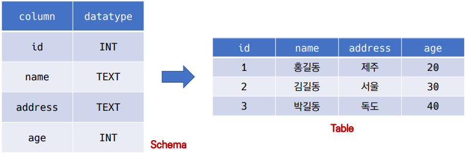
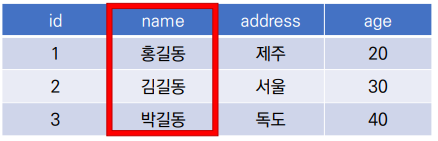
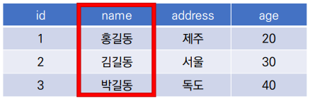
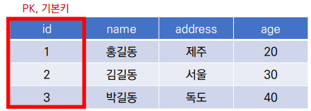
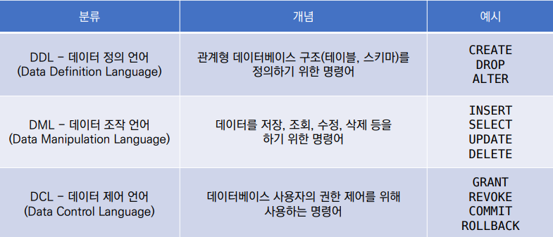

# 데이터 베이스

> **Database**
> 
> 인터넷의 자료 저장하는 곳

- 데이터 베이스는 **체계화된 데이터**의 모음

- 여러 사람이 공유하고 사용할 목적으로 통합 관리되는 정보의 집합

- 논리적으로 연관된 (하나 이상의) 자료의 모음으로 그 내용을 고도로 구조화 함으로써 검색과 갱신의 효율

- 즉 **몇 개의 자료 파일을 조직적으로  통합**하여 **자료 항목의 중복을 없애고 자료를 구조화하여 기억**시켜 놓은 **자료의 집합체**

- 데이터베이스로 얻는 장점
  
  - 데이터 중복 최소화
  
  - 데이터 무결성 (정확한 정보를 보장)
  
  - 데이터 일관성
  
  - 데이터 독립성 (물리적/ 논리적)
  
  - 데이터 표준화
  
  - 데이터 보안 유지

## 관계형 데이터베이스

> **RDB** (Relational Database)
> 
> - 서로 관련된 데이터를 저장하고 접근할 수 있는 데이터베이스 유형
> 
> - 키(key)와 값(value)들의 간단한 관계(relation)를
>   
>   표(table) 형태로 정리한 데이터베이스

### 용어

- **스키마(Schema)**
  
  - 데이터 베이스에서 자료의 구조, 표현방법, 관계 등 전반적인 명세를 기술한 것

| column  | datatype |
|:-------:|:--------:|
| id      | INT      |
| name    | TEXT     |
| address | TEXT     |
| age     | INT      |

- **테이블(table)**
  
  - 열과 행의 모델을 사용해 조직된 데이터 요소들의 집합
  
  
  
  - **열 (column, 필드)**: 열에 고유한 데이터 형식 지정
    
    
  
  - **행(row, 레코드, 값)** : 실제 데이터가 저장되는 형태
    
    

- **기본키(primary key)** : 각 행(레코드)의 고유 값
  
  - 반드시 설정해야 함
  
  - 데이터베이스 관리 및 관계 설정 시 주요하게 활용 
    
    

## 관계형 데이터베이스 관리 시스템

> RDBMS
> 
> 관계형 모델을 기반으로 하는 데이터베이스 관리시스템을 의미

- SQL (structured Query Language)
  
  - 관계형 데이터베이스 관리 시스템의 데이터 관리를 위해 설계된 특수 목적으로 프로그래밍 언어
  
  - 데이터베이스 스키마 생성 및 수정

## SQL

> Structured Quaery Language

- 관계형 데이터베이스 관리시스템의 데이터 관리를 위한
  
  특수 목적으로 설계된 프로그래밍 언어

- 데이터베이스 스키마 생성 및 수정

- 자료의 검색 및 관리

- 데이터베이스 객체 접근 조정 관리



#### 

기초 문법

##### 테이블 생성

- `CREATE TABLE` + `테이블 이름` ;

```
CREATE TABLE classmates(
  id INTEGER PRIMARY KEY,
  name TEXT
);
```

##### 테이블 목록 조회

- `.tables`

```
.tables

classmates
```

##### 특정 테이블 스키마 조회

- `.schema classmates`

```
.schema classmates


CREATE TABLE classmates(
  id INTEGER PRIMARY KEY,
  name TEXT
);
```

##### 값 추가

- `INSERT INTO` + 테이블 이름 + `VALUES` + column 값 ;

```
INSERT INTO classmates VALUES (1, '김철수');
INSERT INTO classmates VALUES (2, '김영희');
```

##### 테이블 조회

- `SELECT * FROM` + 테이블 이름 ;
  - `*` 는 column **전부 다** 보여주는 것, `*` 자리에 **특정 column**(ex. name)만 넣어서 보여 줄 수도 있음

```
SELECT * FROM classmates;

1 | 김철수
2 | 김영희
```

```
.headers on
.mode column
SELECT * FROM classmates;

id  name
--  ----
1   김철수
2   김영희
```

```
SELECT name FROM classmates;

name
----
김철수
김영희
```

- Primary Key 설정 하지 않았을 때
  - `SELECT rowid, * FROM` + 테이블 이름 ;
  - `rowid`는 SQLite에서 자동으로 제공하고 있는 PK. 값이 1씩 증가하는 모습을 보임.

```
SELECT rowid, * FROM classmates;

rowid  name  age  address
-----  ----  ---  -------
1      홍길동   23   
2      홍길동   23     서울
3      김철수   40     서울
```

##### 테이블 삭제

- `DROP TABLE` + 테이블 이름

```
DROP TABLE classmates;
```

##### 필드 제약 조건

- `NOT NULL` : NULL 값 입력 금지
- `UNIQUE` : 중복 값 입력 금지 (NULL 값은 중복 입력 가능)
- `PRIMARY KEY` : 테이블에서 반드시 하나 NOT NULL + UNIQUE
- `FOREIGN KEY` : 외래키. 다른 테이블의 Key
- `CHECK` : 조건으로 설정된 값만 입력 허용
- `DEFAULT` : 기본 설정 값

```
CREATE TABLE students(
  id INTEGER PRIMARY KEY,
  name TEXT NOT NULL,
  age INTEGER DEFAULT 1 CHECK (0 < age)
)
```

- `id`는 **integer**이고 **유일한 값**으로 쓰겠다
- `name`은 **text**이고 **값이 없는 것**을 허용하지 않겠다
- `age`는 **integer**이고 **default 값은 1**인데 **age가 0보다 큰지 확인**해라 음수값을 넣으면 넣지 말라고 할 것
  - 음수값을 넣었을 때, 오류 메세지 :
    - `Runtime error : CHECK constraint failed : 0 < age`

### CRUD

> CREATE, READ, UPDATE, DELETE

#### CREATE

##### INSERT

- 테이블에 단일 행 삽입
  - `INSERT INTO` **테이블 이름 (컬럼1, 컬럼2)** `VALUES` **(값1, 값2)**;
- 테이블에 정의된 모든 컬럼에 맞춰 순서대로 입력
  - `INSERT INTO` **테이블 이름** `VALUES` **(값1, 값2, 값3)**;

```
CREATE TABLE classmates(
  name TEXT,
  age INT,
  address TEXT
)

INSERT INTO classmates VALUES ('홍길동', 23);
Parse error: table classmates has 3 columns but 2 values were supplied
-- 3개의 컬럼이 존재하는데 두 개 컬럼의 값만 입력 되었으므로 error가 뜸

INSERT INTO classmates (name, age) VALUES ('홍길동', 23);
.headers on
.mode column
SELECT * FROM classmates;

name  age  address
----  ---  -------
홍길동  23
```

```
-- 3개의 컬럼에 값을 모두 집어넣고 싶다면
INSERT INTO classmates (name, age, address) VALUES ('홍길동', 23, '서울');
INSERT INTO classmates VALUES ('김철수', 40, '서울')
-- 2개의 방식 모두 가능

SELECT * FROM classmates;

name  age  address
----  ---  -------
홍길동  23
홍길동  23     서울
김철수  40     서울
```

```
-- 여러개의 value를 동시 입력
INSERT INTO classmates VALUES
('홍길동', 30, '서울'),
('김철수', 30, '제주'),
('이호영', 26, '인천');

SELECT * FROM classmates;

name  age  address
----  ---  -------
홍길동  30     서울
김철수  30     제주
이호영  26     인천
```

#### READ

##### SELECT

- 테이블에서 데이터를 조회
- SELECT문은 SQLite에서 가장 기본이 되는 문이며, 다양한 절(clause)과 함께 사용
  - ORDER BY, DISTINCT, WHERE, LIMIT, GROUP BY etc...

```
name  age  address
----  ---  -------
홍길동  30     서울
김철수  30     제주
이호영  26     인천
박민희  29     대구
최혜영  28     전주
```

- **id, name 컬럼 값만 조회**

```
SELECT rowid, name FROM classmates;
rowid  name
-----  ----
1      홍길동  
2      김철수
3      이호영
4      박민희
5      최혜영
```

- **id, name 컬럼 값을 하나만 조회** - `LIMIT` 사용

```
SELECT rowid, name FROM classmates LIMIT 2;
rowid  name
-----  ----
1      홍길동
2      김철수
```

- **id, name 컬럼 값을 세 번째에 있는 값 한 개만 조회** - `LIMIT, OFFSET` 사용
- `OFFSET` - 처음부터 주어진 요소나 지점까지의 차이를 나타내는 정수형
  - 예시
    - 문자열 'abcdef' 에서 문자 'c'는 시작점 'a'에서 2의 OFFSET을 지님
    - SELECT * FROM MY_TABLE LIMIT 10 OFFSET 5
    - 6번째 행 부터 10개 행을 조회 (6번째 행부터 10개를 출력)

```
SELECT rowid, name FROM classmates LIMIT 1 OFFSET 2;
rowid  name
-----  ----
3      이호영
```

- **id, name 컬럼 값 중에 주소가 서울인 경우를 조회** - `WHERE` 사용

```
SELECT * FROM classmates WHERE address='서울';
name  age  address
----  ---  -------
홍길동  30     서울
```

- **age값 전체를 중복없이 조회** - `DISTINCT` 사용

```
SELECT DISTINCT age FROM classmates;
age
---
30
26
29
28
```

#### UPDATE

- 수정

```
UPDATE classmates SET address='서울' WHERE rowid=5;

-- 전주에서 서울로 변경
rowid  name  age  address
-----  ----  ---  -------
1      홍길동  30     
2      김철수  30    제주
3      이호영  26    인천
4      박민희  29    대구
5      최혜영  28    서울
```

#### DELETE

```
DELETE FROM classmates WHERE rowid = 5;

rowid  name  age  address
-----  ----  ---  -------
1      홍길동  30    서울 
2      김철수  30    제주
3      이호영  26    인천
4      박민희  29    대구
```
