# HTML 기초

## HTML

> Hyper Text Markup Language 
> 
> 웹 페이지를 작성(구조화)하기 위한 언어

Markup Language

- 태그들을 이용하여 문서나 데이터의 구조를 명시하는 언어

## HTML 기본구조

```html
<!DOCTYPE html>
<html lang="en">
<head>
  <meta charset="UTF-8">
  <title>Document</title>
</head>
<body>
</body>
</html>
```

- html : 문서의 최상위(root) 요소

- head : 문서 메타데이터 요소
  
  - 문서 제목, 인코딩, 스타일, 외부 파일 로딩 등
  
  - 일반적으로 브라우저에 나타나지 않는 내용

- body : 문서 본문 요소
  
  - 실제 화면 구성과 관련된 내용

### head 예시

| head     | 뜻                                |
| -------- | -------------------------------- |
| <title>  | 브라우저 상단 타이틀                      |
| <meta>   | 문서 레벨 메타데이터 요소                   |
| <link>   | 외부 리소스 연결 요소 (CSS 파일, favicon 등) |
| <script> | 스크립트 요소 (JavaScript 파일/코드)       |
| <style>  | CSS 직접 작성                        |

```html
<head>
  <title>HTML 수업</title>
  <meta charset="UTF-8">
  <link href="style.css" rel="stylesheet">
  <script src="javascript.js"></script>
  <style>
    p {
    color: black;
    }
  </style>
</head>
```

#### Open Graph Protocol

- 메타 데이터를 표현하는 새로운 규약
  
  - HTML 문서의 메타 데이터를 통해 문서의 정보를 전달
  
  - 메타정보에 해당하는 제목, 설명 등을 쓸 수 있도록 정의

### 요소(element)


- HTML 요소는 시작 태그와 종료 태그 그리고 태그 사이에 위치한 내용으로 구성
  
  - 요소는 태그로 컨텐츠(내용)를 감싸는 것으로 그 정보의 성격과 의미를 정의
  
  - 내용이 없는 태그들도 존재(닫는 태그가 없음)
    
    - br, hr, img, input, link, meta

- 요소는 중첩(nested)될 수 있음
  
  - 요소는 중첩을 통해 하나의 문서를 구조화
  
  - 여는 태그와 닫는 태그의 쌍을 잘 확인해야 함
    
    - 오류를 반환하는 것이 아닌 그냥 레이아웃이 깨진 상태로 출력되기 때문에, 디버깅이 힘들어 질 수 있음

### 속성

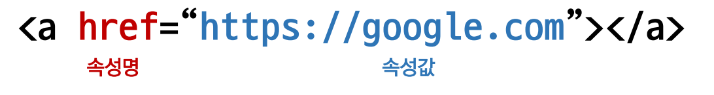

- 속성을 통해 태그의 부가적인 정보를 설정할  수 있음

- 요소는 속성을 가질 수 있으며, 경로나 크기와 같은 추가적인 정보를 제공

- 요소의 시작 태그에 작성하며 보통 이름과 값이 하나의 쌍으로 존재

- 태그와 상관없이 사용 가능한 속성(HTML Global Attribute)들도 있음

#### HTML Global Attribute

- 모든 HTML 요소가 공통으로 사용할 수 있는 대표적인 속성
  
  (몇몇 요소에는 아무 효과가 없을 수 있음)
  
  | 속성       | 뜻                                                |
  | -------- | ------------------------------------------------ |
  | id       | 문서 전체에서 유일한 고유 식별자 지정                            |
  | class    | 공백으로 구분된 해당 요소의 클래스의 목록 (CSS, JS에서 요소를 선택하거나 접근) |
  | data-*   | 페이지에 개인 사용자 정의 데이터를 저장하기 위해 사용                   |
  | style    | inline 스타일                                       |
  | title    | 요소에 대한 추가 정보 지정                                  |
  | tabindex | 요소의 탭 순서                                         |

- HTML Global Attribute
  
  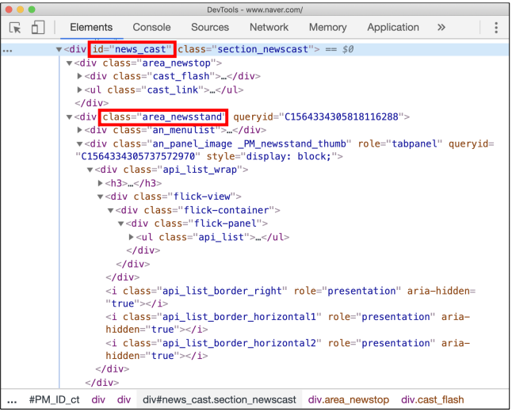

### DOM(Document Object Model) 트리

- 텍스트 파일인 HTML 문서를 브라우저에서 렌더링 하기 위한 구조
  
  - HTML 문서에 대한 모델을 구성함
  
  - HTML 문서 내의 각 요소에 접근
    
    수정에 필요한 프로퍼티와 메서드를 제공함
    
    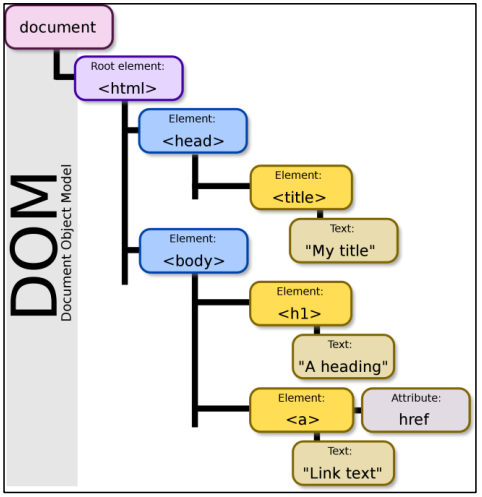
    
    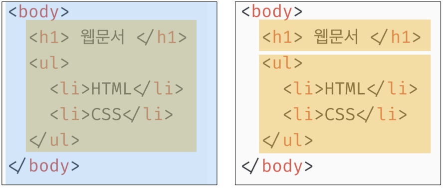

### 인라인 / 블록 요소

HTML 요소는 크게 인라인 / 블록 요소로 나눔

- 인라인 요소는 글자처럼 취급
  
  ``<span>`` `<a>` `` 

- 블록 요소는 한 줄 모두 사용
  
  `<p>` `<div>` `<h>` `<ul>` `<form>`

### 텍스트 요소

| 태그                | 설명                                       |
| ----------------- | ---------------------------------------- |
| <a></a>           | href 속성을 활용하여 다른 URL로 연결하는 하이퍼링크 생성      |
| <b><b>            | 굵은 글씨 요소                                 |
| <strong></strong> | 굵은 글씨로 강조하고자 하는 요소                       |
| <i></i>           | 기울임 글씨 요소                                |
| <em></em>         | 기울임요소로 강조하고자 하는 요소                       |
| <br>              | 텍스트 내에 줄 바꿈 생성                           |
| \            | src 속성을 활용하여 이미지 표현, alt 속성을 활용하여 대체 텍스트 |
| <span></span>     | 의미 없는 인라인 컨테이너                           |
| <mark></mark>     | 텍스트에 하이라이팅                               |

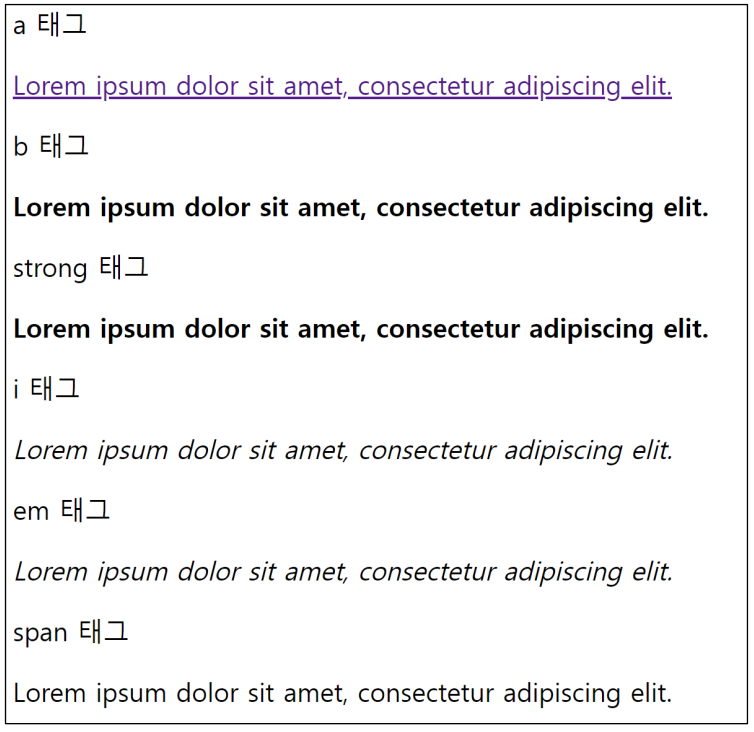

### 그룹 컨텐츠

| 태그                         | 설명                                                     |
| -------------------------- | ------------------------------------------------------ |
| <p></p>                    | 하나의 문단(paragraph)                                      |
| <hr>                       | 문단 레벨 요소에서의 주제의 분리를 의미하며 수평선으로 표현됨 (A Horizontal Rule) |
| <ol></ol>                  | 순서가 있는 리스트 (odered)                                    |
| <ul></ul>                  | 순서가 없는 리스트 (unordered)                                 |
| \<pre></pre>               | HTML에 작성한 내용을 그대료 표현, 보통 고정폭 글꼴이 사용되고 공백문자를 유지         |
| \<blockquote></blockquote> | 텍스트가 긴 인용문, 들여쓰기를 한 것으로 표현                             |
| <div></div>                | 의미 없는 블록 레벨 컨테이너                                       |

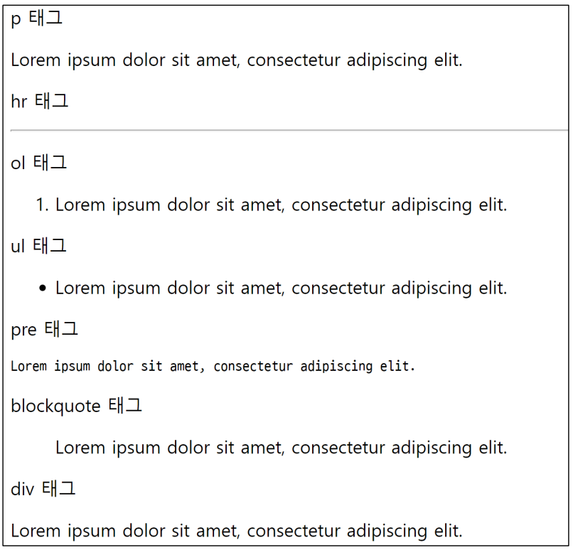

# CSS

> Cascading Style Sheets
> 
> 스타일을 지정하기 위한 언어 - 선택하고, 스타일을 지정한다

### CSS 구문

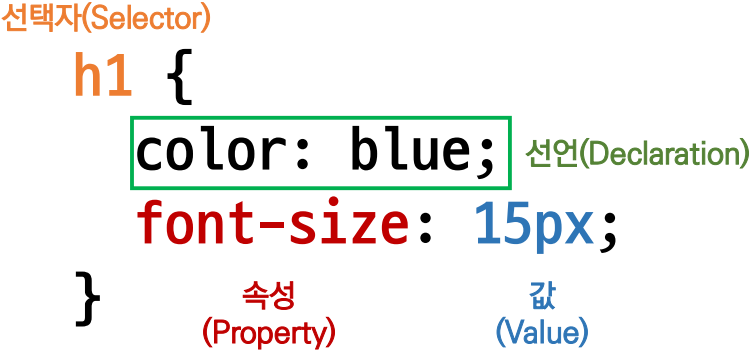

- CSS 구문은 선택자를 통해 스타일을 지정할 HTML 요소를 선택

- 중괄호 안에서는 속성과 값, 하나의 쌍으로 이루어진 선언을 진행

- 각 쌍은 선택한 요소의 속성, 속성에 부여할 값을 의미
  
  - 속성 (Property) : 어떤 스타일 기능을 변경할지 결정
  
  - 값 (Value) : 어떻게 스타일 기능을 변경할지 결정

### CSS 정의 방법

- 내부참조 - <style>
  
  <head> 태그 내에 <style> 지정
  
  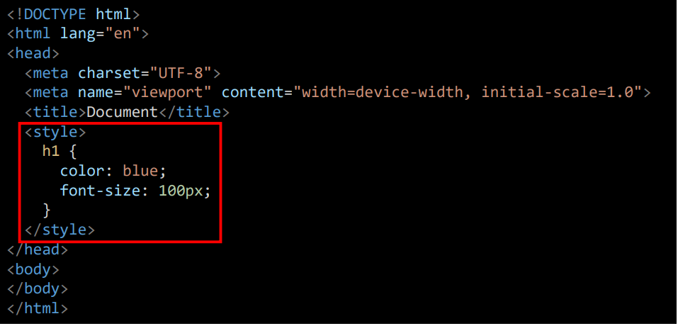

- 외부참조(link file) - 분리된 CSS 파일
  
  외부 CSS 파일을 <head>내 <link>를 통해 불러오기
  
  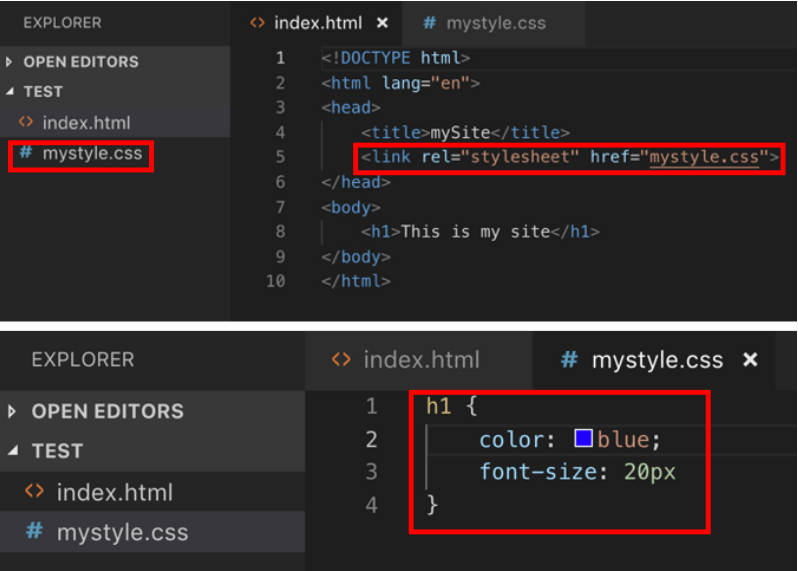

### CSS 기초 선택자

- 요소 선택자
  
  - HTML 태그를 직접 선택

- 클래스(class) 선택자
  
  - 마침표(.)문자로 시작하며, 해당 클래스가 적용된 항목을 선택

- 아이디(id) 선택자
  
  - \# 문자로 시작하며, 해당 아이디가 적용된 항목을 선택
  
  - 일반적으로 하나의 문서에 1번만 사용
  
  - 여러 번 사용해도 동작하지만, 단일 id를 사용하는 것을 권장

### HTML 요소

- ``  이미지 삽입

```html

```

| 속성  | 설명                                 |
| --- | ---------------------------------- |
| src | 이미지 파일의 경로                         |
| alt | 이미지를 볼 수 없는 사용자들을 위한 설명자 (설명적인 문자) |

- `<ins>` 텍스트에 밑줄 넣기

```html
<p><ins>"밑줄 친 부분"</ins>에 들어갈 말을 고르세요</p>
```

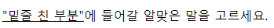

---

- `<sup>` 위첨자 `<sub>` 아래첨자

```html
<p>X<sup></sup> + Y<sup>3</sup> = Z</p>
<p>물을 나타내는 화학식은 H<sub>2</sub>O 입니다.</p>
```

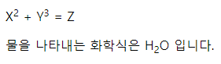

---

- `<q>` 짧은 인용구 - 자동으로 앞뒤에 큰따옴표가 붙음

```html
<p>HTML의 정의는
<q>웹 페이지를 만들기 위한 하이퍼 텍스트 마크업 언어</q> 입니다</p>
```

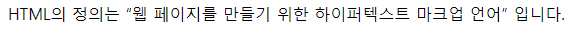

---

- `<blockquote>` 블록 인용구 - 인용부분을 별도의 단락으로 구분

```html
<p>HTML의 정의</p>

<blockquote>

인터넷 서비스의 하나인 월드 와이드 웹을 통해 볼 수
있는 문서를 만들 때 사용하는 프로그래밍 언어의 한 종류이다.

</blockquote>
```

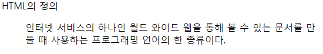

- `<abbr>` 용어의 축약형 표현 - 
  
  <abbr> 태그 위에 마우스 위치하면 용어의 원형이 나타남

```html
<p><strong>    
<abbr title="HyperText Markup Language 5">
HTML5</abbr></strong>
란 웹 문서를 제작하는 데 쓰이는 프로그래밍 언어
인 HTML의 최신규격입니다.</p>
```

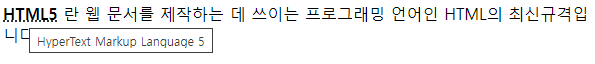

- `<address>` 주소표현 - 이탤릭체로 표현, 위 아래 약간의 공백 자동 삽입

```html
<address>

    서울특별시<br>

    강남구 테헤란로

</address>
```

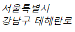

---
