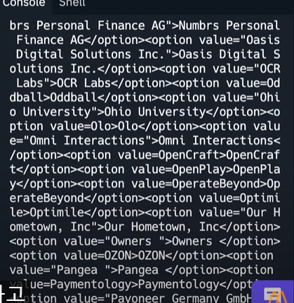
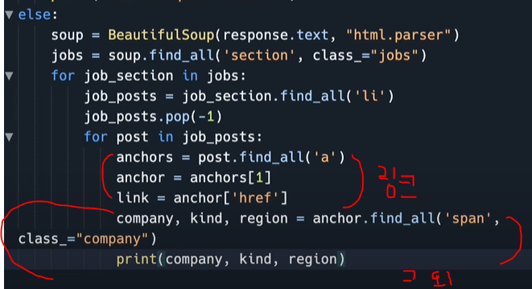

# Python_web scrapping

> pypi.org 패키지 모아놓은 곳

### Requests

- `pip install requests`

- 패키지

- ptython 코드에서 웹사이트로 request 보내게 해줌

- `from requests import get`
  
  - get은 웹사이트를 받아오는 메서드

예제


---

이걸로 데이터를가져와보자




---

이거 데이터 가공 어케 함?

### BeautifulSoup

- 라이브러리 

- document 에서 HTML 태그를 찾아줌

- `from bs4 import BeautifulSoup`

- `.find_all()`
  
  - ```python
    soup.find_all("title")
    # title 이라는 HTML태그를 가져옴
    soup.find_all("a", class_=title")
    # a 태그 중 class가 title 인 걸 가져
    ########class_로 써야함!!!!!########
    ```

- `soup = BeautifulSoup(html_doc, 'html.parser')`
  
  - html.parser 은 너가 뷰티풀수프한테 html을 보내준다고 하는거임


가져올 데이터를 타겟하고 필요없는 정보가 있어서 그거 빼준거임


페이지로 들어갈 링크 작업하고, 

회사이름, 종류, 지역 작업한거임




---

원하는 결과를 얻긴 했는데 태그를 없애지를 못함 

앞에 <span> 붙어있어음

그럴 때 `.string` 쓰면 된다


---

데이터 못 퍼가게 봇을 거르게 되어있는 사이트는 셀레니움을 사용하면 된다


