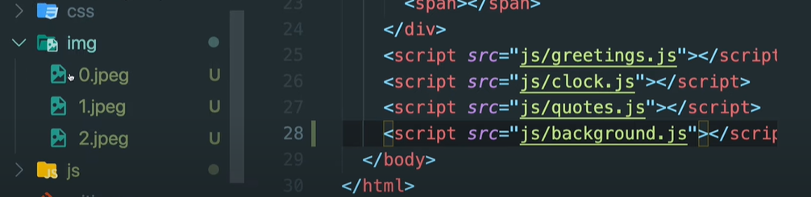

# JavaScript

명언 랜덤으로 나오게 하기

```html
<body>
  <div id="quote">
    <span></span>
    <span></span>
  </div>
  <script>
    const quotes = [
      {quote:"abc", author: "abcdsdf"},
      {quote:"dff", author: "asdfgsa"},
      {quote:"fds", author: "mnbvhjg"},
      {quote:"vcx", author: "poiugjha"},
    ]

    const quote = document.querySelector("#quote span:first-child")
    const author = document.querySelector("#quote span:last-child")
  </script>
</body>
```

## random

- `Math.random()`
  
  - 0과 1 사이의 무작위 소수 
  
  - Math.random() ＊ 10 하면 0과 10 사이의 소수를 구할 수 있다

- `Math.round()`
  
  - 반올림
  
  - Math.round(0.6) => 1 / Math.round(2.1) => 2

- `Math.ceil()`
  
  - 올림

- `Math.floor()`
  
  - 내림

이제 랜덤으로 호출해보자

```html
<body>
  <div id="quote">
    <span></span>
    <span></span>
  </div>
  <script>
    const quotes = [
      {quote:"abc", author: "abcdsdf"},
      {quote:"dff", author: "asdfgsa"},
      {quote:"fds", author: "mnbvhjg"},
      {quote:"vcx", author: "poiugjha"},
    ]

    const quote = document.querySelector("#quote span:first-child")
    const author = document.querySelector("#quote span:last-child")

    const todays = quotes[Math.floor(math.random() * quotes.length)];

    quote.innerText = todays.quote;
    quote.innerText = todays.author;
  </script>
</body>
```

이미지도  랜덤으로 넣어보자

이미지는 img 폴더 안에 있다



```html
<body>
  <script>
    const images = ["0.jpeg","1.jpeg","2.jpeg"];

    const chosenImage = images[Math.floor(math.random() * images.length)];

    const bgImage = document.createElement("img");

    // 아래의 img는 폴더명!!!
    bgImage.src = `img/`${bgImage}`

  </script>
</body>
```

- `.createElement("태그")`
  
  - html 요소(태그)를 생성한다
  
  - 생성은 했는데 배치를 아직 안 해서 javascript 만 알고 있고 html 은 모름

- `.appendChild()`
  
  - html에 배치
  
  - 가장 아래에 배치함

- `.prepend()`
  
  - html에 배치
  
  - 가장 위에 배치함

```html
<body>
  <script>
    const images = ["0.jpeg","1.jpeg","2.jpeg"];

    const chosenImage = images[Math.floor(math.random() * images.length)];

    const bgImage = document.createElement("img");

    bgImage.src = `img/`${bgImage}`
    // 아래와 같이 배치를 해줘야 함
    document.body.appendChild(bgImage);
  </script>
</body>
```
